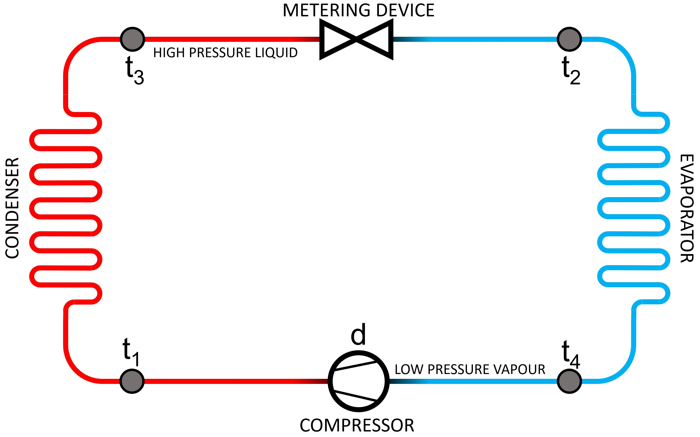

# An early warning system for air conditioners using simple machine learning to minimise maintenance costs and environmental impact

[Zoltan Derzsi](https://orcid.org/0000-0002-4253-4209)
zd8 [at] nyu [?] edu

New York University Abu Dhabi, United Arab Emirates; Heaviside Instiitute

## Abstract

In hot climate countries, a high proportion of energy produced is used up for air conditioning. Since homeowners cannot always recognize when their air conditioners are losing efficiency, several faults remain undetected until catastrophic failure occurs. Here, a low-cost n early warning system is presented that only measures the temperatures at key locations of the refrigeration circuit along with the utilization rate of the system. A neural network is trained to recognize early signs of failure, and the trained model is small enough to fit in a microcontroller. Such a system can help not only with preventing excessive energy consumption prior to complete failure, but can also reduce the amount of refrigerant leaked into the atmosphere.

### Keywords

air conditioning, machine learning, mini split, failure detection, diagnostics, early warning

## Intorduction

The ductless split air conditioner is a popular choice for residential applications. In a hot desert climate country such as the United Arab Emirates (UAE), it was reported in nationwide media that as much as 70\% of the energy produced is used for air conditioning[^1]. Since the air conditioner is one of the highest power domestic appliances in a typical UAE home, maintaining it becomes very important in order to keep their coefficient-of-performance (COP) values as specified by the manufacturer. In the home, the responsibility of maintenance falls to the owner, but in the vast majority of cases a technician is only called when the air conditioner stops working completely[^2]. By this point, catastrophic damage has almost certainly occurred, and the only way to repair is through replacing major components. Perhaps, since air conditioners are sold in electronics stores and hypermarkets, the owners do not consider them as mechanical devices that require regular maintenance, but as an electronic device that has a fixed albeit short lifespan, after which replacement is considered more economical than repair [^3][^4]. However, realistically, the air conditioner, along with all white goods that use a refrigeration circuit, such as dehumidifiers, clothes driers with heat pumps, refrigerators and freezers, should be considered mechanical devices that require regular maintenance.

As the most common cause for a split air conditioner to fail is through refrigerant leak[^5][^6][^7], there are telltale signs that can be used for early diagnosis. Such signs are lower cooling capacity and increased utilization of the compressor, but these are usually ignored by the owner because these cannot easily be measured without tools. At the very least, an increased electricity bill should be an indicator for problems, but often the owner attributes it to climate change and irresponsible use of air conditioning, rather than a sign of oncoming failure.

Another, less common fault is due to poor maintenance: a poor air flow through the coils, either due to clogged filters or improper installation, will also degrade the COP. In extreme cases this could cause the air conditioner to freeze up, and the liquid refrigerant may reach the compressor inflicting damage on it. Additionally, especially in sandy-dusty desert climates, the condenser may become clogged or its fan could slow down due to increased friction. Both these cases would result in decreased COP, as the heat from the home could not be efficiently transferred into the outside environment.

The concept of a fault detection and diagnostic (FDD) system has been around for a while[^8][^3][^9], but for residential applications is rarely used: the legislation does not require it; the manufacturers do not include it because it would increase cost and put them at a disadvantage in competition; and additional components in the refrigeration circuit such as pressure sensors or switches would introduce more points of failure. Instead, FDD systems are most common in commercial air conditioners with much higher reliability requirements.

An FDD system can rely on statistical and/or machine learning models[^10][^11][^12], and they also use environmental sensor data (thermostat setting and user habits, temperature probes, etc.) as well as refrigeration circuit sensor data. There is also a proposal for unifying the FDD system with other systems, such as fire safety and building management systems[^13], which would fit with several smart home and smart building initiatives.

Compared with an FDD system, the Early Warning System (EWS) is only concerned with the air conditioner's refrigeration cycle, in a similar way to how a technician would diagnose it during a callout. When a technician inspects such a system, the key parameters are calculated based on the measured refrigerant pressures and temperatures. While taking the measurements at the high-pressure line would be useful to calculate the subcooling values, which would help with estimating the actual COP of the system under test, the split air conditioners often do not have a high pressure service port due to cost cutting measures. As some air conditioners can be interfaced with home automation systems, the environmental condition monitoring functionality of an FDD system is already implemented: the user would get a notification if the air conditioner "struggles" or fails to maintain temperature for one reason or another.

In this paper, a simple and low cost independent early warning system is introduced that is aimed for residential applications, and it can be implemented on existing split type air conditioners with minimal modifications.

## Methods

While a state of the art FDD system for automotive applications uses 16 sensors in the refrigerant circuit itself[^14], the proposed system in this paper does not require invasive techniques to be installed. It only measures the temperatures at key points in the refrigeration circuit ($t_{1}-t_{3}$ across the condenser; $t_{2}-t_{4}$ across the evaporator) with temperature probes attached to the refrigerant lines. It also measures the compressor utilization rate or its duty cycle $(d)$, which can be done in many ways, such as with the use of inductive or probes or voltage indicators. See figure 1 for the sensor locations in a simple fixed metering device system.


_Figure 1: Sensor locations in the refrigeration circuit: $t_{1}$ and $t_{3}$ are temperatures at the input and the output at the condenser, $t_{2}$ and $t_{4}$ are temperatures at the input and the output of the evaporator. Additionally, the compressor's utilisation rate or duty cycle $d$ is also monitored. The EWS in this paper uses these five variables to detect problems before they escalate into catastrophic failure._

In case of refrigerant loss, the heat transfer overall reduces: to compensate for the reduced thermal capacity, the controller will increase the duty cycle of the compressor. Additionally, the temperature difference across the evaporator increases, but the same measure across the condenser decreases. In another case when there is reduced heat transfer at the evaporator due to poor air flow, the temperature difference across the evaporator reduces, and it increases across the condenser. Again, to compensate for the reduced thermal capacity, the controller increases the duty cycle of the compressor.

With the use of these five variables, it is possible to effectively monitor the operating conditions of the air conditioner, and to detect sub-optimal operating conditions before they escalate into a catastrophic failure. A list of further conditions and example sensor data, obtained from a study where a working air conditioner had single faults induced at a time[^15], are shown in table 1.

| Label | $t_{1}$ | $t_{2}$ | $t_{3}$ | $t_{4}$ | $d$ |
|-------|---------|---------|---------|---------|-----|
| Normal            | 0$^\circ$C | 0$^\circ$C | 0$^\circ$C | 0$^\circ$C | 0 % |
| Low refrigerant   | 0$^\circ$C | 0$^\circ$C | 0$^\circ$C | 0$^\circ$C | 0 % |
| Check air flow    | 0$^\circ$C | 0$^\circ$C | 0$^\circ$C | 0$^\circ$C | 0 % |
| Check condenser   | 0$^\circ$C | 0$^\circ$C | 0$^\circ$C | 0$^\circ$C | 0 % |
| High thermal load | 0$^\circ$C | 0$^\circ$C | 0$^\circ$C | 0$^\circ$C | 0 % |

_Table 1: EWS fault labels and sensor values. While these were obtained from a working system[^15], updating these values will be required to be changed appropriately for different devices due to variance in thermal capacity, materials used, installation conditions and sensor locations.

### Data processing: traditional statistics and machine learning

In this EWS, the five variables described above are used to describe the overall status of the refrigeration circuit inside the air conditioner. One might be tempted to simplify this, by simply taking the temperature differences across the coils into account for instance. Unfortunately, the temperature difference information at the heat exchangers alone would not provide enough information to reach an accurate conclusion: the temperature difference at the condenser and the evaporator can be similar at the "Low refrigerant" and "Check condenser" conditions. Statistically, it would be possible to separate these two conditions with different heat exchanger models, but without access to the pressure sensor data to calculate superheat and subcooling, the statistical model would be complex and less reliable. Additionally, the increased complexity of this statistical model would require additional computational resources, which would make it difficult to be implemented with low-cost microcontroller systems.

Instead, rather than looking at a statistical model created from the five individual variables, it more sensible to concatenate the sensor data into a five element vector or represent it as a five-by-one pixel image after appropriate rescaling. Since there are only a handful of labels in table 1, and the number of pixels are very low when compared with computer vision applications, a very small neural network can be trained to reliably recognize the contents of this image. In this implementation, the labels of these images will correspond to the problem detected based on sensor data. An added benefit of the neural network application is that it can be trained with purely synthetic data prior to installation, and the trained model can be fine-tuned or even retrained during or after installation.

In practice, for a particular manufacturer or installation, one would need to be aware of both the normal and the abnormal operational data for the neural network to be trained effectively. An example set of data for normal and faulty operation of the author's bedroom air conditioner is made publicly available.

## Implementation and results

The training and testing data was generated using Matlab: using the previously acquired temperatures and duty cycle values, the script rescales the sensor values for maximum dynamic range. Using these parameters, the data generator script creates Gaussian distributions with a high number of samples and exports the data. The generated data is used to train the neural network in a different script, which was written using Python, with the TensorFlow[^16] framework. It was trained with 75000 images, and achieved more than 99\% detection accuracy. A set of example images for each condition is shown in figure 2.


_Figure 2: After rescaling the sensor data to fit the dynamic range of the 8-bit binary grayscale format used, each row represents a condition shown in table 1. The neural network is trained with this data and is doing image classification. In an embedded implementation, since the training data is already rescaled, the neural network can work with raw sensor values directly._

### Data generation and the machine learning model

For the synthetic training and testing data, a normal set of temperature and duty cycle values need to be set. This is unique to the air conditioner the neural network is analysing, and must be re-trained for different devices. For generating a large number of data points, Matlab's internal functions are used to generate Gaussian distributions with specified mean values and standard deviations for each condition. The same process generated the "training" and "testing" data but with different random number generator settings, which is used to evaluate the performance of the neural network during development. In the data repository, the included data generator script takes care of rescaling the temperature values in the Gaussian distributions between 0 and 255, and generates the black and white 5-by-1 pixel images in the required format for TensorFlow to process. Then, it creates a compressed file with the images in the required structure.

Following the importing of the data, the included Python code in is used to train a neural network with an input layer of 94 neurons, and the output layer of 6 neurons. The training is not finished until the validation passes with the accuracy of 99\% or better. Afterwards, the trained neural network is exported so it can be inferred onto a microcontroller system.

## Discussion

The neural network was trained to recognize a few reasons for decrease of COP through image classification: when it sees the compiled five-pixel image of the sensor data, it has to decide which of the previously trained images it is the most similar to. While sensor data can be represented in a number of ways, the visual representation was chosen to make use of the image processing facilities included with TensorFlow. This way, the code can be simple and concise. An additional compromise was made with the rescaling of data. This can be beneficial to reduce quantisation errors from measurements, and may be implemented on a hardware level by manually adjusting the reference voltages of the analog to digital converters for example. It should be noted that the hardware to be implemented with this neural network should take care of sample acquisition and running average calculations, so that only steady-state data is being fed to the neural network. This way, false warnings may be avoided.
After successful training and validation, the neural network is exported, and practically any 5-element vector may be fed into it to produce the decision. With the included script, the neural network was trained to a very high accuracy, much higher (1%) than it is expected from statistical models (5%) in a similar situation. This was done so that it would be able to recognize a fairly low decrement of COP, which would go undetected in many cases by environmental temperature monitoring or subjective evaluation alone. If the owner of the air conditioner adheres to the warning indicated by this system, not only a catastrophic failure could be prevented, but also can ensure that no excess energy consumption occurs beforehand. Since the principal source of energy is fossil fuel in hot climate countries in 2022, higher energy consumption results in higher carbon emissions as well. Additionally, if this system detects a low refrigerant charge due to a leak and it is acted upon promptly, the carbon footprint reduction can be even more dramatic. When the EWS is used on inexpensive R22 systems or with high global warming potential (GWP) R22 replacements such as R404A or R407C, the environmental impact can be even more significant, especially when considering that there are millions of these units in operation currently. Further, as low COP air conditioners are more affordable, this EWS can be instrumental in minimising the environmental impact of them. Therefore, this EWS design and its example implementation is released as public domain.

The system may be developed further by interfacing it with the air conditioning controller, and the neural network may be trained differently, perhaps with additional sensors to be suitable for bi-directional heat pumps and variable refrigerant volume systems.

## Acknowledgements, funding, and conflict of interest

The author would like to thank Matthew Karau at the Engineering Design Studio and Professor Sunil Kumar, both at New York University Abu Dhabi for the stimulating discussions and for the provision of some of the tools and resources. The author would also like to thank New York University Abu Dhabi's Postdoctoral Preskilling Development Fund, for funding the TensorFlow training and certification process.

The author would explicitly like not to thank the property maintenance companies, whom shall be not be named due to legal reasons, the author is stuck with. Their poor service practices caused the author's bedroom air conditioner to fail multiple times, which forced the author -among other things- to develop the EWS methodology and the initial data set described in this paper.

The author has received no funding. The author declares no competing interest.

## Data availability

The code that generates the data and trains the neural network can be downloaded at:
[https://github.com/ha5dzs/fridgie_paper](https://github.com/ha5dzs/fridgie_paper) Please cite the code as:

```
(add info here once its separate doi is ready)

```

###### A note on why things are the way things are

[^1]: Bardsley, D.: [Working from Home Could Create Surge in Gulf’s AC Bills and Emissions](https://www.thenationalnews.com/uae/environment/working-from-home-could-create-surge-in-gulf-s-ac-bills-and-emissions-1.1077001). The National, Accessed 23/10/2023

[^2]: Breuker, M. S., & Braun, J. E. (1998). Common faults and their impacts for rooftop air conditioners. Science and Technology for the Built Environment, 4(3), 303. [https://doi.org/10.1080/10789669.1998.10391406](https://doi.org/10.1080/10789669.1998.10391406)

[^3]: Pérez-Belis, V., Braulio-Gonzalo, M., Juan, P., & Bovea, M. D. (2017). Consumer attitude towards the repair and the second-hand purchase of small household electrical and electronic equipment. A Spanish case study. Journal of cleaner production, 158, 261-275. [https://doi.org/10.1016/j.jclepro.2017.04.143](https://doi.org/10.1016/j.jclepro.2017.04.143)

[^4]: Salvia, G., Cooper, T., Fisher, T., Harmer, L., & Barr, C. (2015). What is broken? Expected lifetime, perception of brokenness and attitude towards maintenance and repair. [https://irep.ntu.ac.uk/id/eprint/12817](https://irep.ntu.ac.uk/id/eprint/12817)

[^5]: Chandra, A. R., & Arora, R. C. (2012). Refrigeration and air conditioning. PHI Learning Pvt. Ltd. [ISBN: 9788120339156](https://isbnsearch.org/isbn/9788120339156)

[^6]: Kim, W., & Braun, J. E. (2012). Evaluation of the impacts of refrigerant charge on air conditioner and heat pump performance. International journal of refrigeration, 35(7), 1805-1814. [https://doi.org/10.1016/j.ijrefrig.2012.06.007](https://doi.org/10.1016/j.ijrefrig.2012.06.007)

[^7]: Kim, D. H., Park, H. S., & Kim, M. S. (2014). The effect of the refrigerant charge amount on single and cascade cycle heat pump systems. International journal of refrigeration, 40, 254-268. [https://doi.org/10.1016/j.ijrefrig.2013.10.002](https://doi.org/10.1016/j.ijrefrig.2013.10.002)

[^8]: [Stouppe, D. E., & Lau, Y. S. (1989). Air conditioning and refrigeration equipment failures. National Engineer, 93(9), 14-17.](https://scholar.google.com/scholar?hl=hu&as_sdt=0%2C5&q=touppe%2C+D.%2C+Lau%2C+Y.%3A+Air+conditioning+and+refrigeration+equipment+failures.+National+Engineer+93%289%29%2C+14%E2%80%9317+%281989%29&btnG=)

[^9]: Rogers, A. P., Guo, F., & Rasmussen, B. P. (2019). A review of fault detection and diagnosis methods for residential air conditioning systems. Building and Environment, 161, 106236. [https://doi.org/10.1016/j.buildenv.2019.106236]https://doi.org/10.1016/j.buildenv.2019.106236)

[^10]: Hu, M., Chen, H., Shen, L., Li, G., Guo, Y., Li, H., ... & Hu, W. (2018). A machine learning bayesian network for refrigerant charge faults of variable refrigerant flow air conditioning system. Energy and Buildings, 158, 668-676. [https://doi.org/10.1016/j.enbuild.2017.10.012](https://doi.org/10.1016/j.enbuild.2017.10.012)

[^11]: Lei, Q., Zhang, C., Shi, J., & Chen, J. (2022). Machine learning based refrigerant leak diagnosis for a vehicle heat pump system. Applied Thermal Engineering, 215, 118524. [https://doi.org/10.1016/j.applthermaleng.2022.118524](https://doi.org/10.1016/j.applthermaleng.2022.118524)

[^12]: Godahewa, R., Deng, C., Prouzeau, A., & Bergmeir, C. (2022). A Generative Deep Learning Framework Across Time Series to Optimize the Energy Consumption of Air Conditioning Systems. IEEE Access, 10, 6842-6855. [https://doi.org/10.1109/ACCESS.2022.3142174](https://doi.org/10.1109/ACCESS.2022.3142174)

[^13]: Awawdeh, M., Bashir, A., Faisal, T., Alhammadi, K., Almansori, M., & Almazrouei, S. (2019, March). Embedded ventilation air conditioning system for protection purposes with IoT control. In 2019 Advances in Science and Engineering Technology International Conferences (ASET) (pp. 1-6). IEEE. [https://doi.org/10.1109/ICASET.2019.8714295](https://doi.org/10.1109/ICASET.2019.8714295)

[^14]: Lei, Q., Zhang, C., Shi, J., & Chen, J. (2022). Machine learning based refrigerant leak diagnosis for a vehicle heat pump system. Applied Thermal Engineering, 215, 118524. [https://doi.org/10.1016/j.applthermaleng.2022.118524](https://doi.org/10.1016/j.applthermaleng.2022.118524)

[^15]: Kim, M., Payne, W. V., Domanski, P. A., Yoon, S. H., & Hermes, C. J. (2009). Performance of a residential heat pump operating in the cooling mode with single faults imposed. Applied thermal engineering, 29(4), 770-778. [https://doi.org/10.1016/j.applthermaleng.2008.04.009](https://doi.org/10.1016/j.applthermaleng.2008.04.009)

[^16]: Abadi, M., Agarwal, A., Barham, P., Brevdo, E., Chen, Z., Citro, C., ... & Zheng, X. (2016). Tensorflow: Large-scale machine learning on heterogeneous distributed systems. arXiv preprint arXiv:1603.04467. [https://www.tensorflow.org/](https://www.tensorflow.org/)